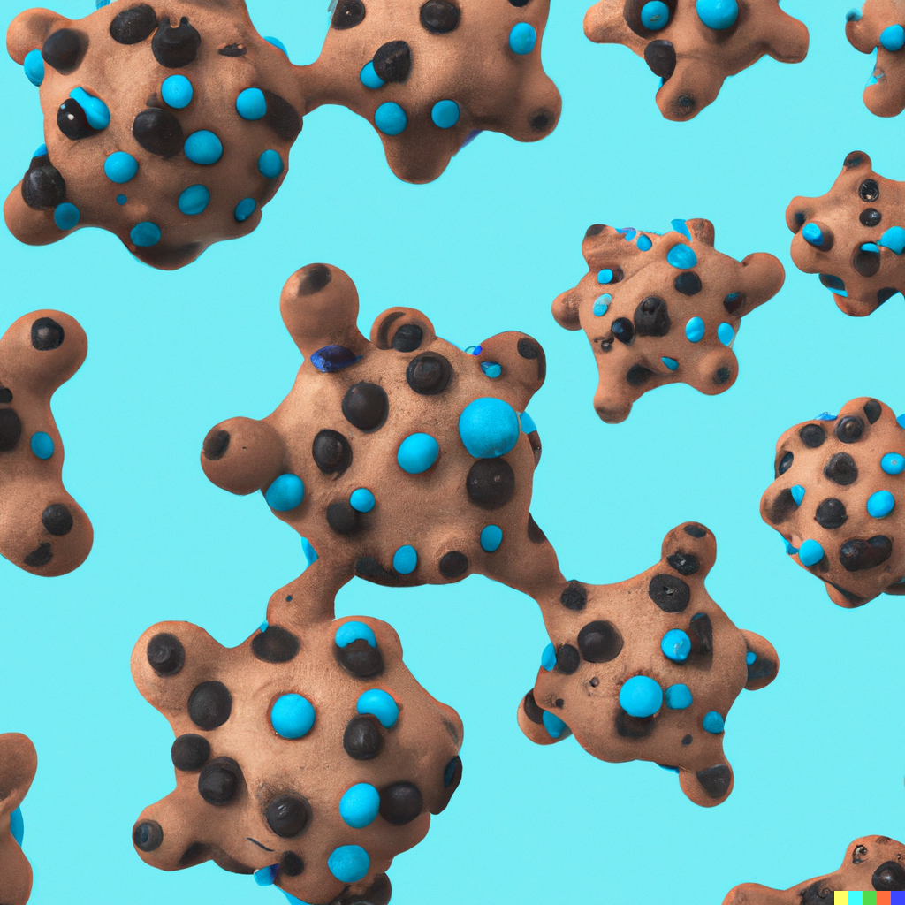

<!--
<p align="center">

</p>
-->

<!--
[](https://pypi.org/project/cookiecutter-poetry/)
[](https://github.com/fpgmaas/cookiecutter-poetry/actions/workflows/main.yml?query=branch%3Amain)
[](https://pypi.org/project/cookiecutter-poetry/)
[](https://fpgmaas.github.io/cookiecutter-poetry/)
](https://img.shields.io/github/license/fpgmaas/cookiecutter-poetry)
 -->

**_This is a modern Cookiecutter template that can be used to initiate a Python project with all the necessary tools for development, testing, and deployment._**
We have taken inspiration from the following project:
[fpgmaas/cookiecutter-poetry](https://raw.githubusercontent.com/fpgmaas/cookiecutter-poetry/main)

**It supports the following features:**

## Template features:

- [Poetry](https://python-poetry.org/) for dependency management
- CI/CD with [GitHub Actions](https://github.com/features/actions)
  - TODO: REPLACE with Space Automation
- Pre-commit hooks with:
  - [pre-commit](https://pre-commit.com/)
- Code quality with:
  - [black](https://pypi.org/project/black/)
    - TODO: Initial formatting of code with black
  - [ruff](https://github.com/charliermarsh/ruff) Ruff is an extremely fast Python linter, written in Rust.
    - ⚡️ 10-100x faster than existing linters
    - 🛠️ `pyproject.toml` support
    - 🤝 Python 3.11 compatibility
    - 📦 Built-in caching, to avoid re-analyzing unchanged files
    - 🔧 Autofix support, for automatic error correction (e.g., automatically remove unused imports)
    - 📏 Over [500 built-in rules](https://beta.ruff.rs/docs/rules/)
    - ⚖️ [Near-parity](https://beta.ruff.rs/docs/faq/#how-does-ruff-compare-to-flake8) with the built-in Flake8 rule set
    - 🔌 Native re-implementations of dozens of Flake8 plugins, like flake8-bugbear
    - ⌨️ First-party editor integrations for [VS Code](https://github.com/charliermarsh/ruff-vscode) and [more](https://github.com/charliermarsh/ruff-lsp)
    - 🌎 Monorepo-friendly, with [hierarchical and cascading configuration](https://beta.ruff.rs/docs/configuration/#pyprojecttoml-discovery)
    - [mypy](https://mypy.readthedocs.io/en/stable/)
    - [deptry](https://github.com/fpgmaas/deptry/)
- TODO: Publishing to Biolexis Space Package Repo
  - Publishing to [Pypi](https://pypi.org) or [Artifactory](https://jfrog.com/artifactory) by creating a new release on GitHub
- Testing and coverage with:
  - [pytest](https://docs.pytest.org/en/7.1.x/)
  - [codecov](https://about.codecov.io/)
- Documentation with
  - [MkDocs](https://www.mkdocs.org/)
- Compatibility testing for multiple versions of Python with:
  - [Tox](https://tox.wiki/en/latest/)
- Containerization with:
  - [Docker](https://www.docker.com/)

---

<p align="center">
  <a href="https://biolexistx.jetbrains.space/p/blx-cc/repositories/blx-cookiecutter-poetry/files/main/docs">Documentation</a> \
- <a href="https://biolexistx.jetbrains.space/p/blx-cc/repositories/blx-cookiecutter-poetry-example">Example</a> -
  <a href="https://biolexistx.jetbrains.space/p/blx-cc/packages/pypi/blx-py-pkg-test/blx-cookiecutter-poetry-exmp?v=0.0.1&tab=overview">Biolexis Space Python Package</a>
</p>

---

## Quickstart

On your local machine, navigate to the directory in which you want to
create a project directory, and run the following two commands:

#### TODO: Install from BLX space package reop

```bash
# pip install blx-cookiecutter-poetry
# ccp
```

Install `cookiecutter` and directly pass the URL to this
Space repository to the `cookiecutter` command:

```bash
pip install cookiecutter
cookiecutter https://biolexistx.jetbrains.space/p/blx-cc/repositories/blx-cookiecutter-poetry
```

    --->

Create a repository on GitHub, and then run the following commands, replacing `<project-name>`, with the name that you gave the Github repository and
`<github_author_handle>` with your Github username.

```bash
cd <project_name>
git init -b main
git add .
git commit -m "Init commit"
git remote add origin git@git.jetbrains.space/biolexistx/blx-cc/<project_name>.git
git push -u origin main
```

Finally, install the environment and the pre-commit hooks with

```bash
make install
```

You are now ready to start development on your project! The CI/CD
pipeline will be triggered when you open a pull request, merge to main,
or when you create a new release.

To finalize the set-up for publishing to PyPi or Artifactory, see
[here](https://fpgmaas.github.io/cookiecutter-poetry/features/publishing/#set-up-for-pypi).
For activating the automatic documentation with MkDocs, see
[here](https://fpgmaas.github.io/cookiecutter-poetry/features/mkdocs/#enabling-the-documentation-on-github).
To enable the code coverage reports, see [here](https://fpgmaas.github.io/cookiecutter-poetry/features/codecov/).

## Acknowledgements

This project is partially based on
[FPgmaas cookiecutter project ](https://github.com/fpgmaas/cookiecutter-poetry.git)
which acknowledges -
[Audrey Feldroy\'s](https://github.com/audreyfeldroy)\'s great
[cookiecutter-pypackage](https://github.com/audreyfeldroy/cookiecutter-pypackage)
repository.
